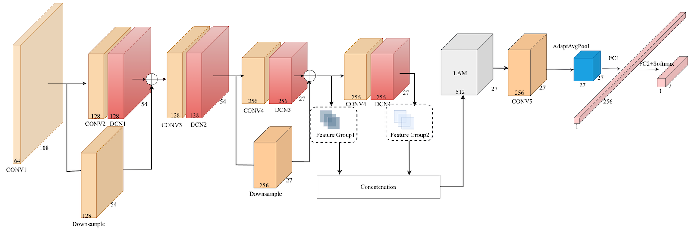

## Introduction

This repository is source code for the paper "Galaxy Morphological Classification of the Legacy Surveys with Deformable Convolutional Neural Networks" under review.

## Catalogue
[Baidu NetDisk](https://pan.baidu.com/s/1wk-mj7jABl6sZvCYZ0Ki8w?pwd=dvnd)

## Citation
```
@article{wei2023dcn,
   author = {Wei, Shoulin and Lu, Wei and Dai, Wei and Liang, Bo and Zhang, Zhijian and Zhang, Xiaoli },
   title = {Galaxy Morphological Classification of the Legacy Surveys with Deformable Convolutional Neural Networks},
   journal = {under review},
   volume = {XXX},
   number = {XXX},
   pages = {XXX},
   ISSN = {XXX-XXX-XXX},
   DOI = {XXX/XXX},
   url = {https://dx.doi.org/XXX/XXX},
   year = {2023},
   type = {Journal Article}
}
```